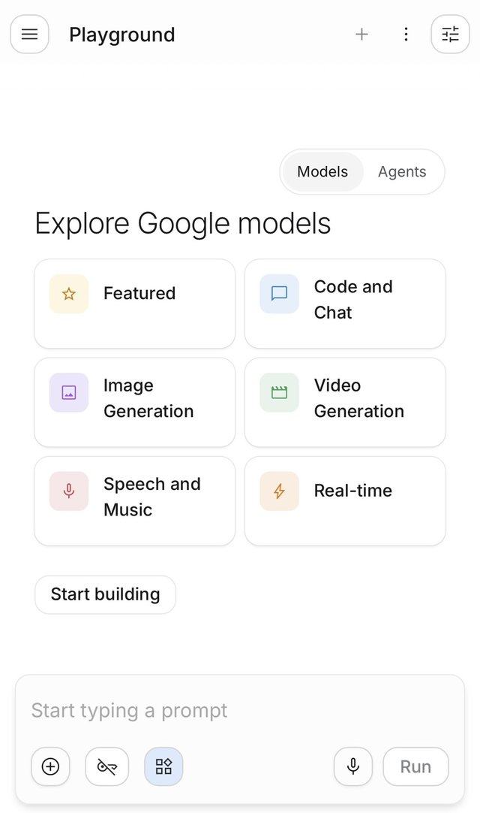
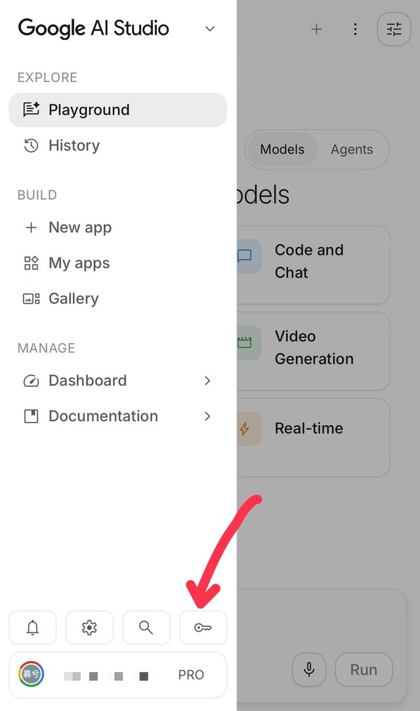
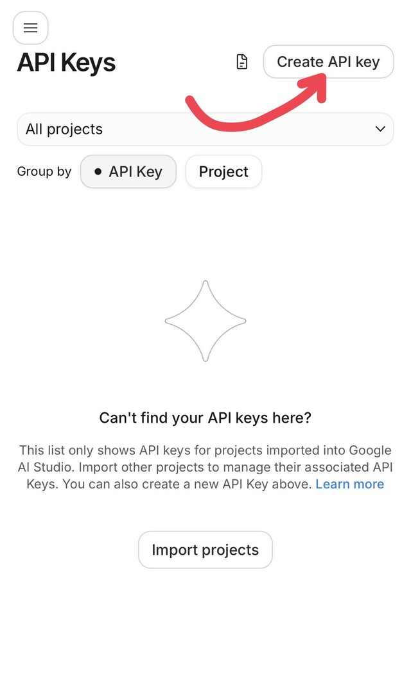
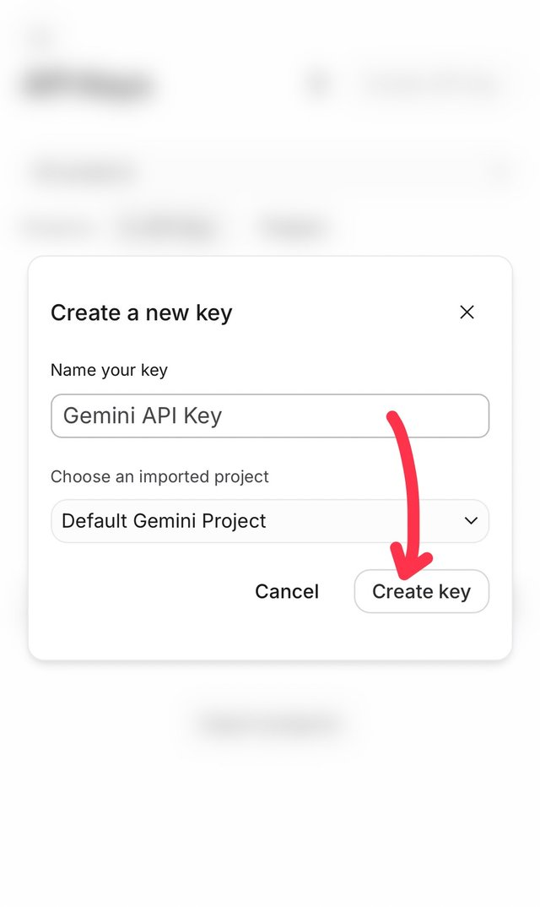
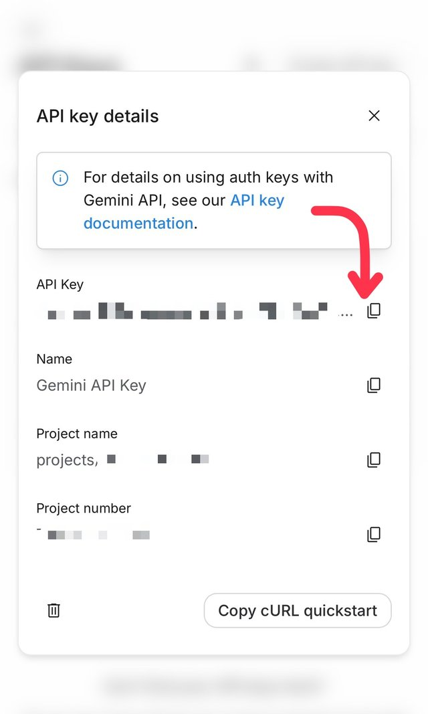
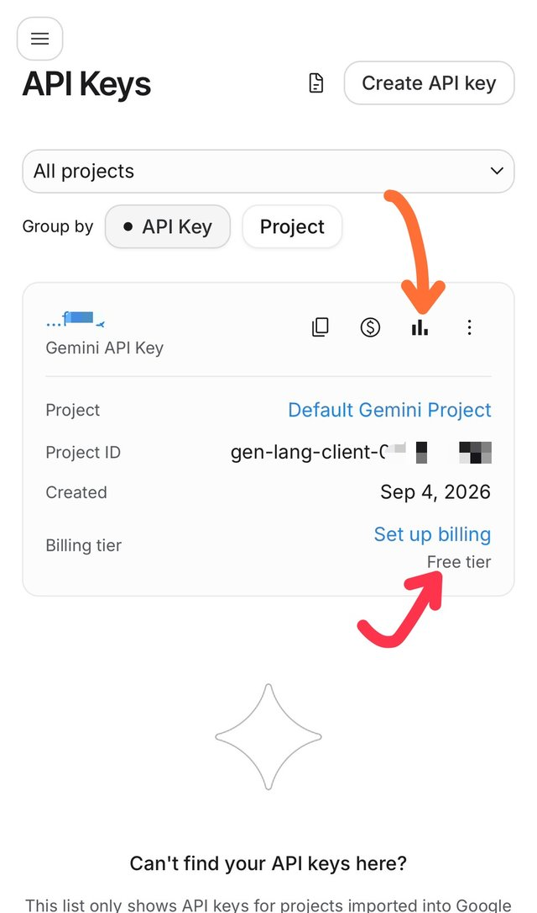
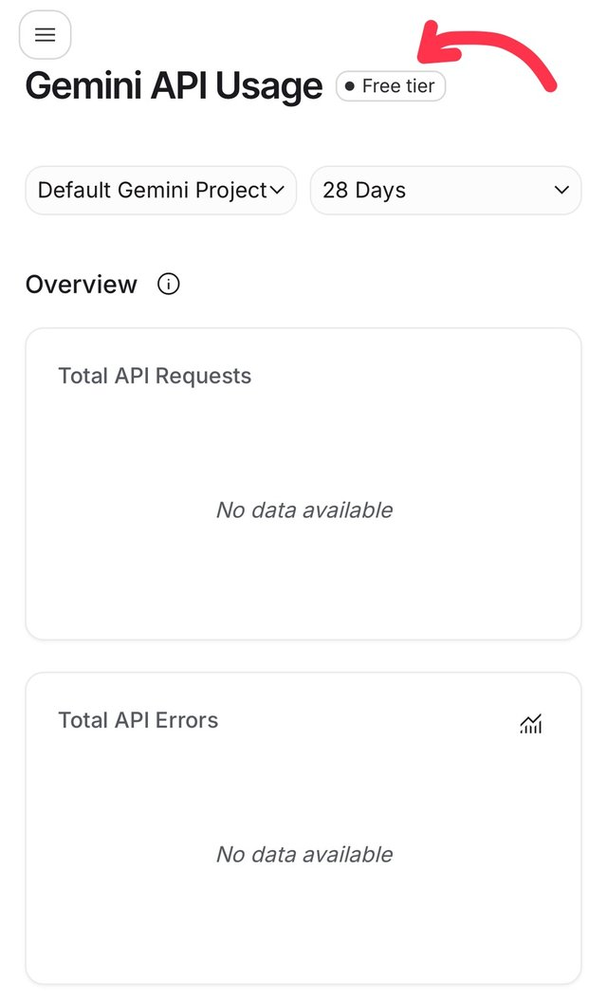
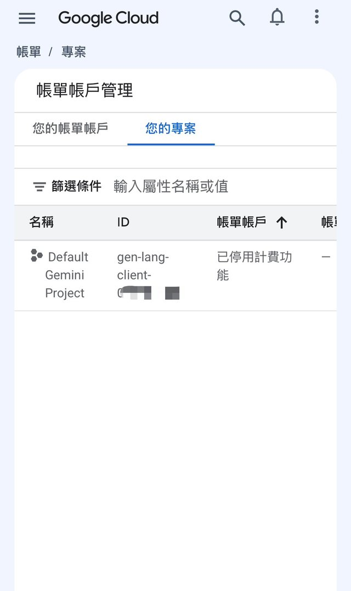

# 棋室 Chambre

一個大廳、一把鑰匙，四個房間裡陪你的都是同一個他。

這是完全在瀏覽器運作的單檔棋室大廳。公開版目前可進入牌桌 Cartes 與西洋棋 Échecs；五子棋 Gomoku、暗棋 Banqi 尚在施工。

## 開玩三步

1. 打開棋室大廳，按右上角「設定」。
2. 貼上 OpenAI 相容 API 的端點、金鑰與模型名，再上傳角色卡或直接手填角色資料。
3. 關閉設定，點房卡進入想玩的房間。

## 金鑰教學

站內有同一份圖文版：大廳「設定」金鑰欄下的「看圖文教學」，或直接開 `guide.html`。

不用裝 SillyTavern 或任何程式，只要一把 API 金鑰。Google AI Studio 有免費額度可供入門，免費層不需要綁信用卡。整趟大約兩分鐘，手機也能做。

### 拿金鑰（六步）

**1. 開 AI Studio，登入 Google 帳號。** 網址 `aistudio.google.com`，進來會是 Playground 畫面。

**2. 點左上角選單，按最下面那排的鑰匙圖示。**

**3. 進到 API Keys 頁，按右上角「Create API key」。**

**4. 名字照預設就好，專案選「Default Gemini Project」，按「Create key」。** 這個專案是 AI Studio 自動幫你建的，不用先去 Google Cloud 開任何東西。

**5. 按 API Key 旁邊的複製圖示，金鑰就在剪貼簿裡了。** 這串字只給你自己看，關掉視窗後也隨時能回這頁再複製。

**6. 回到棋室大廳，按右上角「設定」，按「Google AI Studio」快選鈕代填端點，把金鑰貼進「金鑰」欄，按「撈清單」挑模型。** 建議模型 `gemini-3.1-flash-lite`：快、免費層額度夠房內短對話；供應商調整可用模型時，以撈到的清單為準。

### 確認自己是免費層

回到 API Keys 頁看金鑰卡片：紅箭頭處「Billing tier」寫 **Free tier** 就是免費層；橘箭頭那個長條圖圖示是**看流量**，點進去能看今天用掉多少、有沒有撞到每分鐘上限。

流量頁的標題旁邊也會掛一顆「Free tier」，兩邊都寫免費就是免費。剛建好的金鑰還沒用過，下面顯示 No data available 是正常的。

想再確認沒有綁卡：Google Cloud 主控台的「帳單 → 您的專案」會看到 Default Gemini Project 標著「已停用計費功能」。這是正常狀態，不用碰它；點動作選單也只有停用、變更、鎖定三項，沒有東西需要開。

免費層有每分鐘次數上限，玩到一半他不說話，等一分鐘再試多半就好。真的要開計費是另一回事，這裡不教。

### 其他供應商

也可以使用 OpenRouter：按快選鈕，填入它提供的金鑰與模型名即可。請只使用你信任的 API 供應商。

金鑰只放在自己的瀏覽器。不要貼進公開 repo、issue、截圖、雲端筆記或公開貼文；外洩的金鑰可能被別人消耗額度。

## 共用鑰匙怎麼運作

大廳把端點、金鑰、模型、角色資料與兩個頭像存在本站的 `localStorage`，鍵名是 `chambre_settings_v1`。GitHub Pages 上的大廳與各房都位於 `muxihana.github.io`，因此同一個瀏覽器能在同一 origin 下共讀這份設定。

各房修改設定後也會把較新的版本同步回大廳；更新時間較新的設定優先。直接連到房頁的人仍可在房內自行設定，不必先經過大廳。每個房間自己的棋局、戰績或記憶使用各自的鍵，大廳不會讀寫。

## 隱私聲明

棋室是純靜態頁面，沒有站方後端。API 金鑰、角色卡與頭像只存在目前瀏覽器的本站儲存空間；站方不經手，也沒有可供站方讀取的資料庫。

只有在房內角色需要開口，或你主動按「撈清單」時，瀏覽器才會直接向設定的 API 端點送出請求。共用電腦使用完畢，請回大廳設定按「清除所有資料」。這只清除共用設定，不會動各房自己的資料。

## 已知限制

- 資料不會跟著帳號同步；換瀏覽器、換裝置、使用無痕模式或清除網站資料後，設定不會自動搬家。
- Gomoku 與 Banqi 房卡仍在施工，現在不能進入。
- API 供應商若不允許瀏覽器跨來源請求，撈清單或房內對話可能失敗，但房間本身仍可使用。
- PNG 角色卡只讀取 `tEXt` 區塊中 key 為 `chara` 的酒館卡資料；普通圖片請改從頭像欄位上傳。

## 授權

本專案採用 [MIT License](LICENSE)（Copyright (c) 2026 Muxi / muxihana）。

各房間是獨立的 repo、各自授權：牌桌 Cartes、五子棋 Gomoku、暗棋 Banqi 為 MIT；西洋棋 Échecs 因打包 Stockfish 引擎，整包為 GPLv3。大廳只以連結連到各房，不含任何房間的程式碼。
